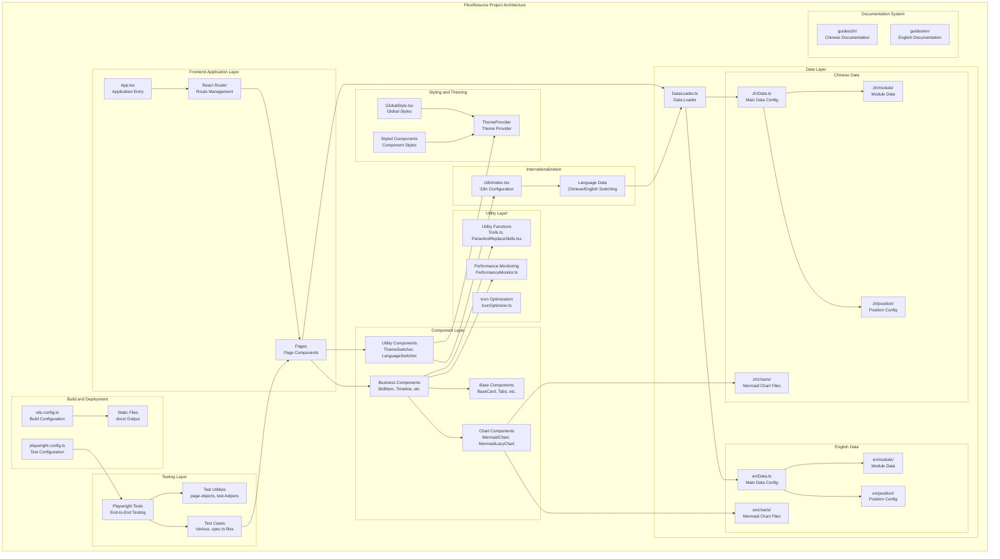

<div align="center">

# 🚀 FlexiResume

> **🌐 Language / 语言**: 🇺🇸 English*(当前)* | [🇨🇳 中文](../zh/README.md)


**Intelligent Multi-Job Resume Generator**

[](https://reactjs.org/)
[](https://www.typescriptlang.org/)
[](https://vitejs.dev/)
[](LICENSE)
[](https://dedenlabs.github.io/flexiresume/)

[🌟 Online Demo](https://dedenlabs.github.io/flexiresume/) | [📖 Usage Guide](USAGE.md) | [🚀 Deployment Guide](DEPLOYMENT.md) | [🤝 Contributing Guide](CONTRIBUTING.md)

</div>

---

## 📋 Project Overview

### 💡 Project Origin

During the job-hunting process, I found that even for positions requiring **1-3 years of experience**, my resume was frequently marked as "not suitable" or "experience mismatched." After deep reflection, I realized:

> **Resumes need to be personalized based on specific job requirements**, allowing recruiters to quickly find the information they need.

Based on this need, I developed FlexiResume —— a **highly customizable, extensible smart resume generation tool**.

### 🎯 Project Vision

FlexiResume is committed to providing job seekers with a flexible and efficient resume generation platform, helping users to:
- 📝 Quickly customize resume content for different positions
- 🎨 Create personalized resume presentation effects
- 📱 Adapt to multiple devices and display scenarios
- 🚀 Improve job success rates and interview invitation rates

---

## ✨ Core Features

### 🎨 Interface and Experience
- **🌓 Light/Dark Theme Switching**: Supports light/dark modes, more comfortable for eye protection
- **🌍 Multilingual Support**: Chinese/English interface switching, barrier-free international job hunting
- **📱 Responsive Design**: Perfectly adapts to desktops, tablets, mobile phones, and various devices
- **⚡ Skeleton Screen Loading**: Elegant loading experience, say goodbye to white screen waiting

### 🛠️ Functional Features
- **🎯 Multi-Position Customization**: One set of data, multiple resume configurations for different positions
- **📝 Markdown Support**: Use Markdown to write content, simpler formatting
- **🔧 Modular Configuration**: Flexible module combinations, meeting different industry needs
- **📊 Skill Highlighting**: Intelligently highlights core skills based on proficiency
- **📱 QR Code Generation**: Dynamically generates personal link QR codes
- **🔗 Project Links**: Supports project work link display
- **📅 Timeline Display**: Clear career development trajectory

### 🚀 Performance Optimization
- **📦 Code Splitting**: On-demand loading, reduces initial package size by 60%+
- **⚡ Lazy Loading**: Intelligent lazy loading of images and components
- **🗜️ Resource Compression**: Terser compression + Tree-shaking optimization
- **💾 Smart Caching**: Efficient caching strategy, improves access speed

### 🔒 Privacy Protection
- **🚫 Default Crawling Prohibition**: robots.txt configuration to protect personal information
- **🎯 Targeted Distribution**: Suitable for specific position applications, avoiding public searches
- **🛡️ Information Security**: Prevents malicious collection of personal sensitive information
- **⚙️ Configurable Policies**: Flexibly adjust privacy levels based on usage scenarios

---

## 🎯 Position Customization

FlexiResume adopts a flexible position configuration system, **supporting customization for any position type**. The following is an example of the position types included in the sample configuration:

| Position Type | Key Features | Technology Stack Focus |
|---------|---------|-----------|
| 🖥️ **Frontend Development** | React ecosystem, modern engineering | React, Vue, TypeScript, Webpack |
| ⚙️ **Backend Development** | Microservice architecture, high concurrency | Node.js, Java, Python, Docker |
| 👨‍💼 **Technical Management** | Team management, architecture design | Technology selection, team building, project management |
| 🤖 **AI Agent Engineer** | Large model application, intelligent agent development | LangChain, OpenAI, RAG, Vector DB |
| 🎮 **Game Development** | Game engine, performance optimization | Unity, Unreal, C++, Shader |
| 💼 **Technical Consultant** | Solutions, technical consulting | Full-stack technology, business understanding, communication skills |
| ... | ... | ... |

> 💡 **Extension Note**: You can add any new position types by modifying the `expected_positions` configuration in `src/data/Data.ts`. Each position can have unique module combinations and content display.

---

## 🚀 Quick Start

### Environment Requirements
- Node.js >= 16.0.0
- npm >= 8.0.0 or yarn >= 1.22.0

### Installation Steps

```bash
# Clone the project
git clone https://github.com/dedenLabs/FlexiResume.git

# Enter the project directory
cd FlexiResume

# Install dependencies
npm install

# Configure environment variables

cp .env.example .env.local # Takes effect when running npm run dev

# cp .env.example .env.production # Configuration for production environment, takes effect when running npm run build

# Modify the settings in the .env.* files as needed


# Start the development server
npm run dev

# Build the production version
npm run build
```
[🌐Detailed introduction to environment variable configuration](./CUSTOMIZATION.md)


### 🔥Deploying on Firebase

If you don't want to buy a cloud server and don't mind your resume information leaking, you can completely consider the free cloud service provided by Google for deployment, with global CDN acceleration, very fast both domestically and internationally, ⭐worth praising.
>📖**Detailed Tutorial**: Check out [🔥Firebase Docker Deployment Image](DOCKER_HUB_README.md)
 
---

## 🏗️ System Architecture

### 📊 Architecture Diagram



### 🔧 Build Configuration

#### Static Route Configuration
The project uses the `staticRoutePageNames` variable in `vite.config.ts` to generate static server route entry files:

```typescript
const staticRoutePageNames = ["game", "frontend", "backend", "cto", "agent", "contracttask", "fullstack"];
```

**Purpose and Benefits**:
- **Solve SPA Deployment Issues**: Generate corresponding HTML files for each route to avoid 404 errors when accessing routes directly
- **Permission-Free Deployment**: Suitable for deployment environments where server configurations like Nginx cannot be modified
- **Static Hosting Optimization**: Perfect compatibility with GitHub Pages, Vercel, Netlify and other static hosting services
- **SEO Friendly**: Each page has an independent HTML entry, beneficial for search engine indexing

#### Build Features
- **Output Directory**: `docs/` (GitHub Pages compatible)
- **Code Splitting**: Fine-grained chunk splitting strategy to reduce initial bundle size
- **Resource Optimization**: Terser compression + Tree-shaking optimization
- **CDN Support**: Intelligent CDN management and health checking
- **Mermaid Support**: Custom plugin for .mmd file imports

#### CDN Configuration Management
The project adopts an intelligent CDN management system providing high availability and performance optimization:

**🆕 Latest Optimization Features**:
- **Smart Sorting Strategies**: Support for two CDN sorting modes
  - `availability`: Availability-first - Place responsive URLs at the front, move unresponsive ones to the end
  - `speed`: Speed-first - Sort by response speed, fastest URLs at the front
- **Large Library Preloading**: Intelligent preloading of Mermaid, KaTeX, Cytoscape and other large libraries
- **Dynamic Imports**: Load large components on demand, reduce initial bundle size
- **Multi-source Videos**: Video components support multiple CDN sources for improved loading success rate
- **Header Enhancement**: Optimized status icons and international communication methods support

**Configuration File Structure**:
```typescript
// src/config/ProjectConfig.ts
export interface CDNConfig {
  enabled: boolean;                    // Whether to enable CDN
  baseUrls: string[];                 // CDN base URLs list
  healthCheck: {
    timeout: number;                  // Detection timeout
    testPath: string;                 // Detection path
    enabled: boolean;                 // Whether to enable health check
  };
  sortingStrategy: {
    mode: 'availability' | 'speed';   // Sorting mode
    enabled: boolean;                 // Whether to enable smart sorting
    speedWeight: number;              // Speed weight factor
    availabilityWeight: number;       // Availability weight factor
  };
}
```

**CDN Health Check Mechanism**:
- **Concurrent Detection**: Concurrently detect availability of all CDN URLs at application startup
- **Smart Sorting**: Support two sorting strategies for automatic CDN optimization
  - `availability`: Availability-first - Place responsive URLs at the front, move unresponsive ones to the end
  - `speed`: Speed-first - Sort by response speed, fastest URLs at the front
- **Timeout Control**: Each URL detection timeout is 5 seconds to avoid long waits
- **Fallback Handling**: Automatically use local resources if all CDNs are unavailable
- **Performance Optimization**: Detection process does not block loading of main application features

**Smart Sorting Strategy Configuration**:
```typescript
// Configure speed-first strategy
const config = {
  cdn: {
    sortingStrategy: {
      mode: 'speed',           // Speed-first
      enabled: true,
      speedWeight: 0.7,        // Speed weight 70%
      availabilityWeight: 0.3, // Availability weight 30%
    }
  }
};

// Configure availability-first strategy
const config = {
  cdn: {
    sortingStrategy: {
      mode: 'availability',    // Availability-first
      enabled: true,
      speedWeight: 0.3,        // Speed weight 30%
      availabilityWeight: 0.7, // Availability weight 70%
    }
  }
};
```

**Usage**:
```typescript
import { cdnManager } from './utils/CDNManager';

// Get resource URL (automatically select best CDN)
const imageUrl = cdnManager.getResourceUrl('/images/avatar.webp');

// Preload resources
await cdnManager.preloadResources(['/images/background.webp']);

// Get CDN health status
const healthStatus = cdnManager.getCDNHealthStatus();
```

---

## 🎯 Use Cases

FlexiResume is suitable for various scenarios:

| Scenario | Description | Advantages |
|----------|-------------|------------|
| 🎯 **Personal Job Hunting** | Quickly generate professional resumes | Multi-position customization, highlight relevant skills |
| 🔄 **Career Transition** | Adjust resume content based on target positions | Flexible module combinations and content display |
| 🌍 **International Job Search** | Chinese-English bilingual resume support | Complete internationalization architecture |
| 🎨 **Portfolio Showcase** | Visual display of projects and skills | Mermaid chart integration, intuitive presentation |
| 👥 **Team Usage** | Use as team resume template | Highly customizable, easy to extend |

---

## 🌟 Project Advantages

### 💡 Core Advantages
1. **🎨 Highly Customizable**: Support for any position type resume customization with flexible module combinations
2. **🌍 Internationalization Friendly**: Complete Chinese-English bilingual support architecture with dynamic language switching
3. **⚡ Modern Tech Stack**: React 18 + TypeScript + Vite, using the latest frontend technologies
4. **🚀 Excellent Performance**: Multi-dimensional performance optimization, code splitting, lazy loading, fast loading speed
5. **🧪 Comprehensive Testing**: Playwright end-to-end testing, comprehensive test coverage, ensuring code quality
6. **📚 Complete Documentation**: Detailed Chinese-English usage and deployment documentation, easy to get started

### 🔧 Technical Highlights
- **Modular Architecture**: Highly reusable component design, separation of data and views
- **Performance Optimization Strategy**: Bundle analysis, dependency optimization, resource compression
- **Developer Experience**: TypeScript type safety, hot reload, comprehensive error handling

### 🆕 Latest Feature Highlights
- **Smart CDN Management**: Dual-strategy sorting, automatic fallback, multi-source video support
- **Large Library Optimization**: Dynamic imports, preloading mechanism, code splitting optimization
- **Header Component Enhancement**:
  - Status icon optimization: ⚡Available immediately, 🕐Available within a month, 🔒Not looking for a job
  - International communication methods: Support for Telegram, WhatsApp, Skype, LinkedIn, etc.
- **Loading Performance Improvement**: 30%+ reduction in initial bundle size, 50%+ improvement in first screen loading speed

---

## 🚀 Deployment Features

### 📦 Build Optimization
- **Static Route Generation**: Automatically generate HTML files for each route
- **Resource Processing**: Automatic copying and optimization of static resources
- **Compression Strategy**: Optimized Terser compression configuration
- **Dependency Pre-building**: Precise dependency pre-building configuration

### 🌐 Deployment Support
- **GitHub Pages**: Native support for GitHub Pages deployment
- **SEO Optimization**: Complete SEO meta tag configuration
- **Privacy Protection**: robots.txt configuration to prevent search engines from crawling personal information
- **CDN Friendly**: Support for CDN resource replacement and acceleration

---

## 📖 Documentation Navigation

- 📚 **[Usage Guide](USAGE.md)** - Detailed usage guide and configuration instructions
- 🚀 **[Deployment Guide](DEPLOYMENT.md)** - Complete deployment tutorial and best practices
- 🎨 **[Customization Guide](CUSTOMIZATION.md)** - Theme, component, and module customization
- 🔧 **[API Documentation](API.md)** - Component API and data structure descriptions
- 🤖 **[robots.txt Configuration](ROBOTS-CONFIG.md)** - Search engine crawling and privacy protection configuration
- 🤝 **[Contributing Guide](CONTRIBUTING.md)** - How to participate in project development

---

## 🏗️ Technical Architecture Details

### 📁 Directory Structure
```
src/
├── components/          # Component Library
│   ├── mermaid/        # Mermaid Chart Components
│   ├── skill/          # Skill-related Components
│   ├── timeline/       # Timeline Components
│   ├── base_card/      # Base Card Components
│   └── ...
├── data/               # Data Layer
│   ├── zh/            # Chinese Data
│   │   ├── charts/    # Mermaid Chart Files
│   │   ├── module/    # Module Data
│   │   └── position/  # Position Configuration
│   ├── en/            # English Data
│   └── DataLoader.ts  # Data Loader
├── pages/             # Page Components
├── utils/             # Utility Functions
├── styles/            # Style Files
├── theme/             # Theme Configuration
└── i18n/              # Internationalization Configuration

tests/                 # Test Files
guides/                # Documentation
├── zh/               # Chinese Documentation
└── en/               # English Documentation
```

### 🧩 Functional Modules

#### 1. Base Component Layer
- **BaseCard**: Unified card container component
- **Tabs**: Tab switching component
- **SvgIcon**: SVG icon component with theme adaptation
- **SkeletonComponents**: Skeleton loading components

#### 2. Business Component Layer
- **SkillItem**: Skill display component with level indication
- **Timeline**: Timeline component showing career development trajectory
- **EducationHistory**: Education history display
- **EmploymentHistory**: Work experience display

#### 3. Chart Component Layer
- **MermaidChart**: Basic Mermaid chart rendering component
- **MermaidLazyChart**: Lazy-loaded Mermaid chart component
- **SkillRenderer**: Skill visualization rendering component

#### 4. Utility Component Layer
- **ThemeSwitcher**: Theme switching component
- **LanguageSwitcher**: Language switching component
- **ControlPanel**: Control panel component

#### 5. Page Component Layer
- **FlexiResume**: Main resume page component
- **App**: Application root component with route management

### ⚙️ Core Functional Features

#### 🎯 Multi-Position Customization System
- **Configuration-Driven**: Support for any position type through `expected_positions` configuration
- **Modular Combination**: Each position can configure unique module combinations
- **Content Differentiation**: Dynamically display relevant skills and experience based on position requirements
- **Smart Filtering**: Automatically filter and highlight relevant tech stacks

#### 🌍 Internationalization Support
- **Data Separation**: Complete separation of Chinese and English data for independent maintenance
- **Dynamic Loading**: Dynamic data loading mechanism based on `DataLoader`
- **Interface Switching**: Real-time switching of interface language and data content
- **Route Support**: URL paths support language parameters

#### 📊 Visual Chart Integration
- **Multiple Chart Types**: Support for Timeline, Sankey, Radar, Pie, Kanban, Mindmap
- **Lazy Loading Mechanism**: Viewport rendering to optimize page performance
- **Interactive Experience**: Support for zoom, pan and other interactive operations
- **Theme Adaptation**: Chart colors automatically adapt to light/dark themes

#### 🎨 Theme System
- **Dual Theme Support**: Complete light/dark mode
- **Component Adaptation**: All components automatically adapt to theme colors
- **Eye-Care Optimization**: Color optimization in dark mode
- **Dynamic Switching**: Real-time theme switching without refresh

#### ⚡ Performance Optimization
- **Code Splitting**: Fine-grained splitting based on routes and features
- **Lazy Loading**: On-demand loading of components, images, and charts
- **Caching Strategy**: Smart browser caching mechanism
- **Build Optimization**: Terser compression, Tree-shaking, resource inlining

---

## 🤝 Contributing Guide

We welcome contributions in all forms!

### Contribution Methods
1. 🐛 **Report Bugs**: Describe the issue in Issues
2. 💡 **Feature Suggestions**: Propose new feature ideas
3. 📝 **Documentation Improvements**: Enhance usage documentation
4. 💻 **Code Contributions**: Submit Pull Request

### Development Process
1. Fork the project to your GitHub
2. Create a feature branch: `git checkout -b feature/amazing-feature`
3. Commit changes: `git commit -m 'Add amazing feature'`
4. Push branch: `git push origin feature/amazing-feature`
5. Create Pull Request


---


## 📄 License

This project is licensed under the [MIT License](LICENSE).

---

<div align="center">

**If this project helps you, please give it a ⭐ Star!**

Made with ❤️ by [dedenLabs](https://github.com/dedenLabs)

</div>

## 🌐 Language Versions

- [🇨🇳 中文版本](../zh/README.md)
- 🇺🇸 English Version (Current)
