<div align="center">

# 🚀 FlexiResume

> **🌐 Language / 语言**: [🇺🇸 English](../en/README.md) | 🇨🇳 中文 *(当前)*


**智能化多职位简历生成器**

[](https://reactjs.org/)
[](https://www.typescriptlang.org/)
[](https://vitejs.dev/)
[](LICENSE)
[](https://dedenlabs.github.io/flexiresume/)

[🌟 在线演示](https://dedenlabs.github.io/flexiresume/) | [📖 使用教程](USAGE.md) | [🚀 部署指南](DEPLOYMENT.md) | [🤝 贡献指南](CONTRIBUTING.md)

</div>

---

## 📋 项目简介

### 💡 项目起源

在求职过程中，我发现即使对于一些 **1-3年经验的职位**，我的简历仍被多次标记为"不合适"或"经验有差异"。经过深入思考，我意识到：

> **简历需要根据职位的具体需求进行个性化调整**，让招聘方能快速找到他们需要的信息。

基于这一需求，我开发了 FlexiResume —— 一个 **高度自定义、可扩展的智能简历生成工具**。

### 🎯 项目愿景

FlexiResume 致力于为求职者提供一个灵活、高效的简历生成平台，帮助用户：
- 📝 根据不同职位快速定制简历内容
- 🎨 打造个性化的简历展示效果
- 📱 适配多种设备和展示场景
- 🚀 提升求职成功率和面试邀请率

---

## ✨ 核心特性

### 🎨 界面与体验
- **🌓 明暗主题切换**: 支持浅色/深色模式，护眼更舒适
- **🌍 多语言支持**: 中英文界面切换，国际化求职无障碍
- **📱 响应式设计**: 完美适配桌面、平板、手机等各种设备
- **⚡ 骨架屏加载**: 优雅的加载体验，告别白屏等待

### 🛠️ 功能特性
- **🎯 多职位定制**: 一套数据，多种职位简历配置
- **📝 Markdown支持**: 使用Markdown编写内容，格式化更简单
- **🔧 模块化配置**: 灵活的模块组合，满足不同行业需求
- **📊 技能高亮**: 根据熟练度智能高亮显示核心技能
- **📱 二维码生成**: 动态生成个人链接二维码
- **🔗 作品外链**: 支持项目作品链接展示
- **📅 时间线展示**: 清晰的职业发展轨迹

### 🚀 性能优化
- **📦 代码分割**: 按需加载，减少初始包大小60%+
- **⚡ 懒加载**: 图片、组件智能懒加载
- **🗜️ 资源压缩**: Terser压缩 + Tree-shaking优化
- **💾 智能缓存**: 高效的缓存策略，提升访问速度

### 🔒 隐私保护
- **🚫 默认禁止抓取**: robots.txt 配置保护个人信息
- **🎯 定向投放**: 适合特定职位申请，避免公开搜索
- **🛡️ 信息安全**: 防止个人敏感信息被恶意收集
- **⚙️ 可配置策略**: 根据使用场景灵活调整隐私级别

---

## 🎯 职位定制

FlexiResume 采用灵活的职位配置系统，**支持任意职位类型的简历定制**。以下是示例配置中包含的职位类型：

| 职位类型 | 特色亮点 | 技术栈重点 |
|---------|---------|-----------|
| 🖥️ **前端开发** | React生态、现代化工程 | React, Vue, TypeScript, Webpack |
| ⚙️ **后端开发** | 微服务架构、高并发 | Node.js, Java, Python, Docker |
| 👨‍💼 **技术管理** | 团队管理、架构设计 | 技术选型, 团队建设, 项目管理 |
| 🤖 **AI Agent工程师** | 大模型应用、智能体开发 | LangChain, OpenAI, RAG, Vector DB |
| 🎮 **游戏开发** | 游戏引擎、性能优化 | Unity, Unreal, C++, Shader |
| 💼 **技术顾问** | 解决方案、技术咨询 | 全栈技术, 业务理解, 沟通能力 |
| ... | ... | ... |

> 💡 **扩展说明**: 您可以通过修改 `src/data/Data.ts` 中的 `expected_positions` 配置来添加任意新的职位类型。每个职位都可以有独特的模块组合和内容展示。

---

## 🚀 快速开始

### 环境要求
- Node.js >= 16.0.0
- npm >= 8.0.0 或 yarn >= 1.22.0

### 安装步骤

```bash
# 克隆项目
git clone https://github.com/dedenLabs/FlexiResume.git

# 进入项目目录
cd FlexiResume

# 安装依赖
npm install

# 启动开发服务器
npm run dev

# 构建生产版本
npm run build
```

---

## 🏗️ 系统架构

### 📊 架构图

```mermaid
graph TB
    subgraph "FlexiResume 项目架构"
        subgraph "前端应用层"
            App[App.tsx<br/>应用入口]
            Router[React Router<br/>路由管理]
            Pages[Pages<br/>页面组件]
        end

        subgraph "组件层"
            BaseComponents[基础组件<br/>BaseCard, Tabs, etc.]
            BusinessComponents[业务组件<br/>SkillItem, Timeline, etc.]
            MermaidComponents[图表组件<br/>MermaidChart, MermaidLazyChart]
            UtilComponents[工具组件<br/>ThemeSwitcher, LanguageSwitcher]
        end

        subgraph "数据层"
            DataLoader[DataLoader.ts<br/>数据加载器]

            subgraph "中文数据"
                ZhData[zh/Data.ts<br/>主数据配置]
                ZhModules[zh/module/<br/>功能模块数据]
                ZhPositions[zh/position/<br/>职位配置数据]
                ZhCharts[zh/charts/<br/>Mermaid图表文件]
            end

            subgraph "英文数据"
                EnData[en/Data.ts<br/>主数据配置]
                EnModules[en/module/<br/>功能模块数据]
                EnPositions[en/position/<br/>职位配置数据]
                EnCharts[en/charts/<br/>Mermaid图表文件]
            end
        end

        subgraph "样式和主题"
            GlobalStyle[GlobalStyle.tsx<br/>全局样式]
            ThemeProvider[ThemeProvider<br/>主题提供者]
            StyledComponents[Styled Components<br/>组件样式]
        end

        subgraph "工具层"
            Utils[工具函数<br/>Tools.ts, ParseAndReplaceSkills.tsx]
            Performance[性能监控<br/>PerformanceMonitor.ts]
            IconOptimizer[图标优化<br/>IconOptimizer.ts]
        end

        subgraph "国际化"
            I18n[i18n/index.tsx<br/>国际化配置]
            LanguageData[语言数据<br/>中英文切换]
        end

        subgraph "测试层"
            PlaywrightTests[Playwright测试<br/>端到端测试]
            TestUtils[测试工具<br/>page-objects, test-helpers]
            TestSpecs[测试用例<br/>各种.spec.ts文件]
        end

        subgraph "构建和部署"
            ViteConfig[vite.config.ts<br/>构建配置]
            PlaywrightConfig[playwright.config.ts<br/>测试配置]
            StaticFiles[静态文件<br/>docs/目录输出]
        end

        subgraph "文档系统"
            ZhDocs[guides/zh/<br/>中文文档]
            EnDocs[guides/en/<br/>英文文档]
        end
    end

    %% 连接关系
    App --> Router
    Router --> Pages
    Pages --> BusinessComponents
    Pages --> UtilComponents

    BusinessComponents --> BaseComponents
    BusinessComponents --> MermaidComponents

    DataLoader --> ZhData
    DataLoader --> EnData
    ZhData --> ZhModules
    ZhData --> ZhPositions
    EnData --> EnModules
    EnData --> EnPositions

    MermaidComponents --> ZhCharts
    MermaidComponents --> EnCharts

    Pages --> DataLoader
    UtilComponents --> ThemeProvider
    UtilComponents --> I18n

    GlobalStyle --> ThemeProvider
    StyledComponents --> ThemeProvider

    BusinessComponents --> Utils
    BusinessComponents --> Performance

    I18n --> LanguageData
    LanguageData --> DataLoader

    PlaywrightTests --> TestUtils
    PlaywrightTests --> TestSpecs
    TestSpecs --> Pages

    ViteConfig --> StaticFiles
    PlaywrightConfig --> PlaywrightTests
```



### 🔧 构建配置说明

#### 静态路由配置
项目使用 `vite.config.ts` 中的 `staticRoutePageNames` 变量来生成静态服务器路由入口文件：

```typescript
const staticRoutePageNames = ["game", "frontend", "backend", "cto", "agent", "contracttask", "fullstack"];
```

**作用和优势**：
- **解决SPA部署问题**: 为每个路由生成对应的HTML文件，避免直接访问路由时出现404错误
- **无权限部署友好**: 适用于无法修改Nginx等服务器配置的部署环境
- **静态托管优化**: 完美适配GitHub Pages、Vercel、Netlify等静态托管服务
- **SEO友好**: 每个页面都有独立的HTML入口，有利于搜索引擎索引

#### 构建特性
- **输出目录**: `docs/` (适配GitHub Pages)
- **代码分割**: 精细的chunk分割策略，减少初始包大小
- **资源优化**: Terser压缩 + Tree-shaking优化
- **CDN支持**: 支持静态资源CDN替换
- **Mermaid支持**: 自定义插件支持.mmd文件导入

---

## 🎯 适用场景

FlexiResume适用于多种使用场景：

| 场景 | 描述 | 优势 |
|------|------|------|
| 🎯 **个人求职** | 快速生成专业简历 | 多职位定制，突出相关技能 |
| 🔄 **职业转换** | 根据目标职位调整简历内容 | 灵活的模块组合和内容展示 |
| 🌍 **国际求职** | 中英文双语简历支持 | 完整的国际化架构 |
| 🎨 **作品展示** | 项目和技能的可视化展示 | Mermaid图表集成，直观展示 |
| 👥 **团队使用** | 作为团队简历模板 | 高度可定制，易于扩展 |

---

## 🌟 项目优势

### 💡 核心优势
1. **🎨 高度可定制**: 支持任意职位类型的简历定制，灵活的模块组合
2. **🌍 国际化友好**: 完整的中英文双语支持架构，动态语言切换
3. **⚡ 现代化技术栈**: React 18 + TypeScript + Vite，使用最新前端技术
4. **🚀 性能优秀**: 多维度性能优化，代码分割，懒加载，加载速度快
5. **🧪 测试完善**: Playwright端到端测试，全面的测试覆盖，保证代码质量
6. **📚 文档完整**: 详细的中英文使用和部署文档，易于上手

### 🔧 技术亮点
- **模块化架构**: 高度可复用的组件设计，数据与视图分离
- **性能优化策略**: Bundle分析、依赖优化、资源压缩
- **开发体验**: TypeScript类型安全、热更新、完善的错误处理

---

## 🚀 部署特性

### 📦 构建优化
- **静态路由生成**: 自动为每个路由生成HTML文件
- **资源处理**: 自动复制和优化静态资源
- **压缩策略**: Terser压缩配置优化
- **依赖预构建**: 精确的依赖预构建配置

### 🌐 部署支持
- **GitHub Pages**: 原生支持GitHub Pages部署
- **SEO优化**: 完整的SEO meta标签配置
- **隐私保护**: robots.txt配置防止搜索引擎抓取个人信息
- **CDN友好**: 支持CDN资源替换和加速

---

## 📖 文档导航

- 📚 **[使用教程](USAGE.md)** - 详细的使用指南和配置说明
- 🚀 **[部署指南](DEPLOYMENT.md)** - 完整的部署教程和最佳实践
- 🎨 **[自定义指南](CUSTOMIZATION.md)** - 主题、组件、模块自定义
- 🔧 **[API文档](API.md)** - 组件API和数据结构说明
- 🤖 **[robots.txt配置](ROBOTS-CONFIG.md)** - 搜索引擎抓取和隐私保护配置
- 🤝 **[贡献指南](CONTRIBUTING.md)** - 如何参与项目开发

---

## 🏗️ 技术架构详解

### 📁 目录结构
```
src/
├── components/          # 组件库
│   ├── mermaid/        # Mermaid图表组件
│   ├── skill/          # 技能相关组件
│   ├── timeline/       # 时间线组件
│   ├── base_card/      # 基础卡片组件
│   └── ...
├── data/               # 数据层
│   ├── zh/            # 中文数据
│   │   ├── charts/    # Mermaid图表文件
│   │   ├── module/    # 功能模块数据
│   │   └── position/  # 职位配置
│   ├── en/            # 英文数据
│   └── DataLoader.ts  # 数据加载器
├── pages/             # 页面组件
├── utils/             # 工具函数
├── styles/            # 样式文件
├── theme/             # 主题配置
└── i18n/              # 国际化配置

tests/                 # 测试文件
guides/                # 文档
├── zh/               # 中文文档
└── en/               # 英文文档
```

### 🧩 功能模块

#### 1. 基础组件层
- **BaseCard**: 统一的卡片容器组件
- **Tabs**: 标签页切换组件
- **SvgIcon**: SVG图标组件，支持主题适配
- **SkeletonComponents**: 骨架屏加载组件

#### 2. 业务组件层
- **SkillItem**: 技能展示组件，支持等级显示
- **Timeline**: 时间线组件，展示职业发展轨迹
- **EducationHistory**: 教育经历展示
- **EmploymentHistory**: 工作经历展示

#### 3. 图表组件层
- **MermaidChart**: 基础Mermaid图表渲染组件
- **MermaidLazyChart**: 懒加载Mermaid图表组件
- **SkillRenderer**: 技能可视化渲染组件

#### 4. 工具组件层
- **ThemeSwitcher**: 主题切换组件
- **LanguageSwitcher**: 语言切换组件
- **ControlPanel**: 控制面板组件

#### 5. 页面组件层
- **FlexiResume**: 主简历页面组件
- **App**: 应用根组件，路由管理

### ⚙️ 核心功能特性

#### 🎯 多职位定制系统
- **配置驱动**: 通过 `expected_positions` 配置支持任意职位
- **模块化组合**: 每个职位可配置独特的模块组合
- **内容差异化**: 根据职位需求动态展示相关技能和经验
- **智能筛选**: 自动筛选和高亮相关技术栈

#### 🌍 国际化支持
- **数据分离**: 中英文数据完全分离，独立维护
- **动态加载**: 基于 `DataLoader` 的动态数据加载机制
- **界面切换**: 实时切换界面语言和数据内容
- **路由支持**: URL路径支持语言参数

#### 📊 可视化图表集成
- **多图表类型**: 支持Timeline、Sankey、Radar、Pie、Kanban、Mindmap
- **懒加载机制**: 视口内渲染，优化页面性能
- **交互体验**: 支持缩放、平移等交互操作
- **主题适配**: 图表颜色自动适配明暗主题

#### 🎨 主题系统
- **双主题支持**: 完整的浅色/深色模式
- **组件适配**: 所有组件自动适配主题色彩
- **护眼优化**: 深色模式下的颜色优化
- **动态切换**: 实时主题切换，无需刷新

#### ⚡ 性能优化
- **代码分割**: 基于路由和功能的精细分割
- **懒加载**: 组件、图片、图表的按需加载
- **缓存策略**: 智能的浏览器缓存机制
- **构建优化**: Terser压缩、Tree-shaking、资源内联

---

## 🤝 贡献指南

我们欢迎所有形式的贡献！

### 贡献方式
1. 🐛 **报告Bug**: 在 Issues 中描述问题
2. 💡 **功能建议**: 提出新功能想法
3. 📝 **文档改进**: 完善使用文档
4. 💻 **代码贡献**: 提交 Pull Request

### 开发流程
1. Fork 项目到你的 GitHub
2. 创建功能分支: `git checkout -b feature/amazing-feature`
3. 提交更改: `git commit -m 'Add amazing feature'`
4. 推送分支: `git push origin feature/amazing-feature`
5. 创建 Pull Request

---

## 📄 许可证

本项目采用 [MIT License](LICENSE) 开源协议。

---

<div align="center">

**如果这个项目对你有帮助，请给它一个 ⭐ Star！**

Made with ❤️ by [dedenLabs](https://github.com/dedenLabs)

</div>

## 🌐 Language Versions

- 🇨🇳 中文版本 (当前)
- [🇺🇸 English Version](../en/README.md)
